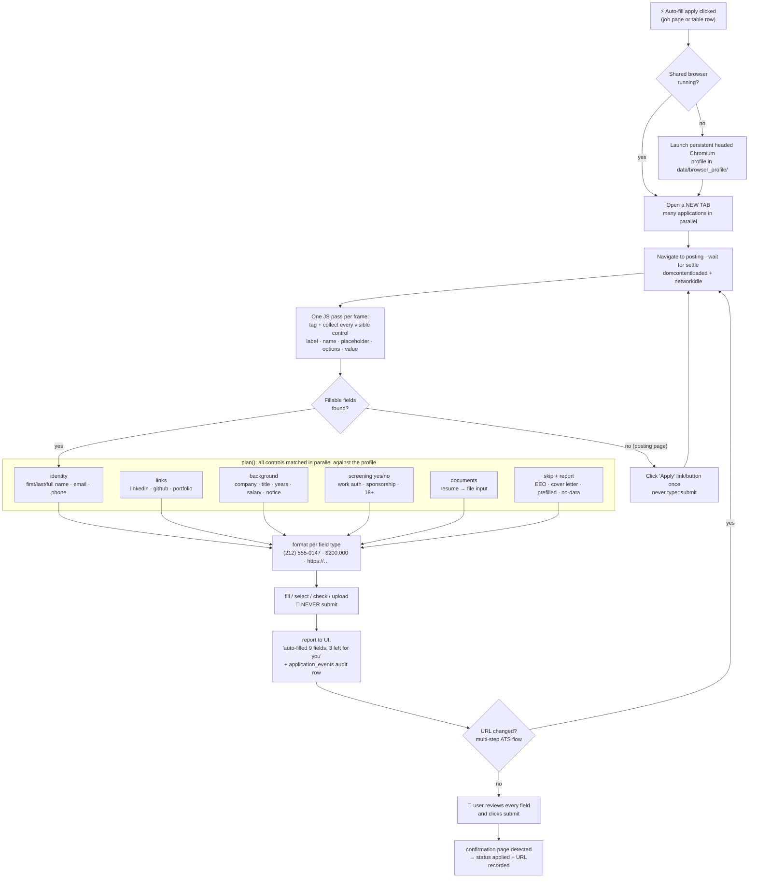

# Auto-fill apply: Stage 2 of application automation

> **Status (2026-06-12): shipped.** Every "⚡ Auto-fill apply" click opens a
> tab in the shared integrated browser, auto-fills the application form from
> the profile, and reports what it filled and what it left for review.
> **It never clicks submit** — the user takes the final pass and submits.

## The contract

1. Clicking ⚡ means auto-applying: the tab opens, the form gets filled.
   The button naming says so everywhere it appears.
2. The engine **never submits**. `click_apply_button()` exists only to get
   from a posting page to its form, is never invoked when fillable fields
   are already present, and refuses `type=submit` controls.
3. Nothing is overwritten: controls that already have a value are skipped.
4. No guessing: demographic/EEO questions, cover letters, education fields,
   and any question without a confident profile answer are skipped **and
   reported**, so the review pass is a checklist, not a hunt.

## Flow

## How matching works (`webapp/autofill.py`)

- **Collection** — one `evaluate()` pass per frame (Greenhouse embeds forms
  in an iframe) tags each visible `input`/`select`/`textarea` with a
  `data-af` handle and returns descriptors: label (via `label[for]`,
  wrapping label, `aria-label(ledby)`), name, id, placeholder,
  autocomplete, select options, radio-group question (fieldset legend or
  field-container label), current value.
- **Matching** — `plan()` is pure logic (offline-tested): ordered regex
  rules over the combined descriptor, specific before generic ("first
  name" wins before the bare-"name" fallback). Input `type=email/tel`
  beats label heuristics. Yes/no screening questions are answered from the
  profile only when the answer is confident (`requires_sponsorship: No` →
  checks the "No" radio); otherwise skipped with a reason.
- **Formatting** — phone `(212) 555-0147`, salary `$200,000`,
  `https://` on URL inputs, `NY` → `New York` for state selects,
  full name split into first/last.
- **Execution** — `fill`/`select_option`/`check`/`set_input_files` per
  control with short timeouts; one stubborn field never aborts the pass.
- **Multi-step flows** — each URL change in the tab (Workday steps, Lever
  `/apply`) triggers a fresh pass on the new page.

## Multi-tab architecture (`webapp/apply_browser.py`)

A persistent Chromium profile can only be opened by one browser instance,
so `BrowserHost` — a single daemon thread that owns the Playwright sync
API — launches the context once and gives every apply session its own tab.
The host polls all tabs (~2/s): settles new URLs, runs fill passes, checks
for confirmation pages, and detects closed tabs. The UI's
`/api/apply-status/{application_id}` returns per-session state plus the
fill summary; both the job-page button and the per-row ⚡ buttons poll it.

Closing the last tab closes the browser; the next ⚡ click relaunches it.
ATS logins survive in `data/browser_profile/` (gitignored).

## Platform awareness & resilience (`webapp/ats.py`)

> **Update (2026-06-15).** The generic engine alone got three things wrong
> often enough to matter; `ats.py` supplies the platform-specific knowledge to
> fix them. Verified end-to-end against the live Coinbase Greenhouse form.

- **Land on the form, not the posting.** `canonical_apply_url()` rewrites a
  link to the page that actually renders fields: Greenhouse `/embed/job_app`,
  Ashby `/application`, Lever `/apply`. This sidesteps both the "click Apply
  first" gate and the cross-origin iframe problem on company-branded boards.
- **Cross-origin embeds.** When the form is still unreachable (a branded page
  embeds the ATS in a cross-origin iframe), `ats_form_iframe_src()` finds the
  ATS iframe and the host navigates the tab straight to it — turning the form
  top-level and readable. The "Apply" gate click is the fallback after that.
- **Cloudflare.** `is_cloudflare_challenge()` detects the interstitial; the
  host surfaces a "solve it in the tab" message and keeps polling. Because the
  challenge reloads the *same* URL, the resume is driven off a `cf_blocked`
  flag (not a URL change), so the fill runs the moment it clears.
- **Custom dropdowns.** Greenhouse's `job-boards` UI, Ashby and Workday render
  dropdowns as React comboboxes, not `<select>`. The collector tags
  `role=combobox` widgets; the executor opens them, reads the live options, and
  clicks the match (with a type-and-pick fallback for typeaheads). Free-text
  fields that happen to match a combobox (e.g. a phone-country selector) are
  left for the user rather than mistyped.
- **Greenhouse schema.** `greenhouse_questions()` pulls the public
  `?questions=true` field map (exact names, types, required flags, option
  labels) and folds it into the collected controls by `id` — so a dropdown
  rendered as a plain input is still answered, and option text is matched
  exactly. Best-effort: any failure degrades to the DOM-only heuristics.

## Multi-pass fill (SPA hydration)

> **Update (2026-06-15).** Application forms are React SPAs that hydrate
> progressively — the server-rendered text inputs (name/email/phone/resume)
> appear first, the custom-question dropdowns mount a beat later. The old
> single, early fill pass caught only the former (the "5 fields" problem).

Each tab now waits for a hydration signal (`[role=combobox]`) and then re-fills
on every host tick until the control count holds steady (`STABLE_PASSES`) or a
cap is hit. Re-fills are idempotent: already-filled text is skipped, and
dropdowns/checkboxes/uploads are remembered in a per-session `done_keys` set so
they're never re-opened. The reported tally is the union across passes; "left
for review" is the latest pass's real skips (excluding already-filled).

> **Coverage depends on the profile.** The engine never guesses screening
> answers, so empty profile fields (`work_authorization`, `linkedin`,
> `location`, …) are reported as left, not invented. Filling out the Profile
> page is the biggest single lever on how many fields auto-complete.

The fill also **falls back to the resume**: `merge_resume` layers
resume-derived values (parsed once by the host) *under* the profile — a set
profile value always wins, but a blank one is backfilled from the resume. So a
sparse profile still fills name/contact/location/company/education from the
resume; EEO and screening answers are never inferred from it.

To make that lever easy to pull, the Profile page (`webapp/profile.py`):
- **Populates from the resume** — `seed_from_resume` extracts name, contact,
  location, current company/title (from the experience section) and
  school/degree/discipline (from education), tolerating PDF space-noise in
  headers. A "Populate from resume" button fills blanks without clobbering edits.
- **Offers curated dropdowns** (`FIELD_OPTIONS`) for the fields whose form
  values are standardised — work auth, sponsorship, degree, and the four EEO
  fields — with options derived from sampling ~100 live Greenhouse postings. A
  stored value outside the list is preserved as a "(current)" option.

## Fill all open tabs (`/api/apply-all`)

A dashboard button adopts **every job tab already open** in the integrated
browser and fills them in one go. The host thread (which owns the Playwright
context) enumerates `context.pages` on an event, binds each qualifying tab to a
session, and runs the same multi-pass fill. Safety: a tab is only filled if it
is a recognised ATS **or** matches a tracked job URL (by exact URL or Greenhouse
job id) — stray Gmail/search tabs are left alone. Unmatched ATS tabs are still
filled, just without DB status. Submission stays manual, per the contract.

A per-job **"Re-fill open tab"** button (`POST /jobs/{id}/refill`) re-runs the
fill on that one job's existing tab — useful after the form finishes hydrating
or after a profile edit. The host clears the session's fill bookkeeping
(`_reset_for_refill`) so the next tick does a fresh multi-pass; if no tab is
open it falls back to launching one.

## Profile-driven fields (2026-06-15)

EEO/demographics, cover letter, education (school/degree/discipline), and
address (street/postal/country) are now **profile fields** on the Profile page
and are filled when set — left blank, they're skipped and reported, never
guessed. Two niceties: demographic **declines** are matched by intent, so one
stored "Decline to self-identify" resolves to whatever the form calls it ("I
don't wish to answer", "I do not want to answer", …); and a combobox that
matched an *identity/contact* field (e.g. a phone-country selector) is left for
the user rather than mistyped.

## What's deliberately NOT automated

| Thing | Why |
|-------|-----|
| Submit | The user's final review is the whole point of Stage 2 — always manual. |
| Custom screening questions with no profile answer | A wrong yes/no can auto-reject; only profile-backed answers are filled, the rest are reported. |
| Any field with no stored value | Never guessed — set it on the Profile page (EEO, cover letter, education, address all live there now) and it fills next pass. |

## Next (Stage 3, per design-application-automation.md)

Per-ATS field maps learned from corrections (when the user edits an
auto-filled value before submitting, record the mapping), and an approval
queue for batch-preparing several applications at once.
