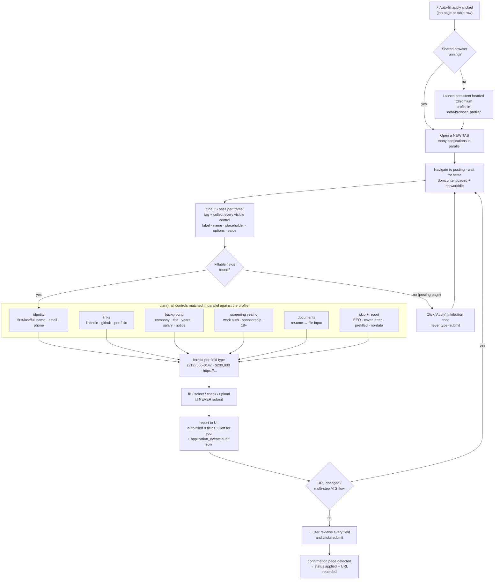

# Auto-fill apply: Stage 2 of application automation

> **Status (2026-06-12): shipped.** Every "⚡ Auto-fill apply" click opens a
> tab in the shared integrated browser, auto-fills the application form from
> the profile, and reports what it filled and what it left for review.
> **It never clicks submit** — the user takes the final pass and submits.

## The contract

1. Clicking ⚡ means auto-applying: the tab opens, the form gets filled.
   The button naming says so everywhere it appears.
2. The engine **never submits**. `click_apply_button()` exists only to get
   from a posting page to its form, is never invoked when fillable fields
   are already present, and refuses `type=submit` controls.
3. Nothing is overwritten: controls that already have a value are skipped.
4. No guessing: demographic/EEO questions, cover letters, education fields,
   and any question without a confident profile answer are skipped **and
   reported**, so the review pass is a checklist, not a hunt.

## Flow

## How matching works (`webapp/autofill.py`)

- **Collection** — one `evaluate()` pass per frame (Greenhouse embeds forms
  in an iframe) tags each visible `input`/`select`/`textarea` with a
  `data-af` handle and returns descriptors: label (via `label[for]`,
  wrapping label, `aria-label(ledby)`), name, id, placeholder,
  autocomplete, select options, radio-group question (fieldset legend or
  field-container label), current value.
- **Matching** — `plan()` is pure logic (offline-tested): ordered regex
  rules over the combined descriptor, specific before generic ("first
  name" wins before the bare-"name" fallback). Input `type=email/tel`
  beats label heuristics. Yes/no screening questions are answered from the
  profile only when the answer is confident (`requires_sponsorship: No` →
  checks the "No" radio); otherwise skipped with a reason.
- **Formatting** — phone `(212) 555-0147`, salary `$200,000`,
  `https://` on URL inputs, `NY` → `New York` for state selects,
  full name split into first/last.
- **Execution** — `fill`/`select_option`/`check`/`set_input_files` per
  control with short timeouts; one stubborn field never aborts the pass.
- **Multi-step flows** — each URL change in the tab (Workday steps, Lever
  `/apply`) triggers a fresh pass on the new page.

## Multi-tab architecture (`webapp/apply_browser.py`)

A persistent Chromium profile can only be opened by one browser instance,
so `BrowserHost` — a single daemon thread that owns the Playwright sync
API — launches the context once and gives every apply session its own tab.
The host polls all tabs (~2/s): settles new URLs, runs fill passes, checks
for confirmation pages, and detects closed tabs. The UI's
`/api/apply-status/{application_id}` returns per-session state plus the
fill summary; both the job-page button and the per-row ⚡ buttons poll it.

Closing the last tab closes the browser; the next ⚡ click relaunches it.
ATS logins survive in `data/browser_profile/` (gitignored).

## What's deliberately NOT automated

| Thing | Why |
|-------|-----|
| Submit | The user's final review is the whole point of Stage 2. |
| EEO / demographic questions | Self-identification is personal; never guessed. |
| Cover letters | Generic text hurts more than an empty field. |
| Education / address details | Not in the profile; wrong guesses are worse than blanks. |
| Unknown yes/no questions | A wrong screening answer can auto-reject. |

## Next (Stage 3, per design-application-automation.md)

Per-ATS field maps learned from corrections (when the user edits an
auto-filled value before submitting, record the mapping), and an approval
queue for batch-preparing several applications at once.
